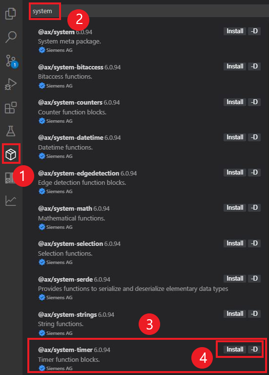
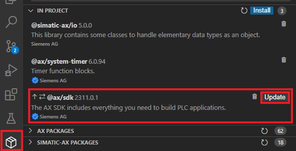

# Setup your library environment

## Goal for this training chapter

After this training session:

- you are able to create workspaces with clone link in the WebIDE
- the login process in to the AX registry is known
- the login into other (external) registries is known
- you've a rough overview about the apax.yml
- you learn how to install dependencies
- you know the apax extension
- you know how to update dependencies
- you have heard, that there are different project types `lib`/`app`
- and you've heard the difference between `devDependencies` and `dependencies`
- you know how to add further dependencies

### Cloning the workspace with clone link

1. Copy the clone link to your clipboard:

    ```iec-st
    git@github.com:simatic-ax/standardizer-tutorial-lib.git
    ```

1. Open the cloud IDE on <https://axcite.me/workspaces>
    > it's possible that you've to login first

1. Click on create

1. Select `Clone from Git`, paste the clone link into the `REPOSITORY` field and press `Create`. Wait until the workspace is created.  

   
    > NOTICE: If your public key of AX is not in your GitHub profile, the creation of the tutorial will fail.

1. Open the workspace


### Login to other registry

For this tutorial are further libraries required, which are hosted at a GitHub registry @simatic-ax. To consume them, it is necessary to login into the GitHub registry.

1. select the file `apax.yml`, click the right mouse button and select `Login to registry`

      

1. Enter the Github URL

       

1. Leave the user name field empty and press `Enter`

      

1. Enter your personal access token from GitHub with `Strg+V`

      

Now you're able to install all dependencies to develop on your library.

### Content of apax.yml

If you're already familiar with `Apax` and the `apax.yml` you can skip this section.

If you want to develop a library with AX, you need some developer tools. It's called SDK. The AX SDK contains some components like:
    - AX Compiler
    - AxUnit Testing Framework
    - SIMATIC downloader
    - ...

For this tutorial just the compiler and the AxUnit Testing Framework are of interest. This tutorial uses some further dependencies from GitHub.

Before we install all required dependencies, lets have a look into the apax.yml. The apax.yml is a configuration file for the Apax package manager. It contains all relevant information for the workspace.

  

#### **Project information**

In the header of this file you find some information about the project.

- `name: standardizer-tutorial-lib` Contains the project name. In this case the library has the name `standardizer-tutorial-lib`
- `version: 0.0.1` the version of the library.
- `type: lib` the project type is lib (library project) another valid value is `app` (application)

> Note:  
>
> - a library always needs a namespace
> - a library can not be executed directly on a PLC because a library must have a `CONFIGURATION` and a `PROGRAM` section, which is necessary to be executed on a PLC

#### **devDependencies**

This section contains dev dependencies which are necessary during the development. In this case just the `@ax/sdk` in version `0.2.499` is required.

#### **dependencies** and **registries**

In this tutorial we need some other libraries. Hence these are dependencies which are necessary for building the library.

In this example, there are two further libraries from the `@simatic-ax` registry required.

For the moment, it's not important to know what the content of these libraries is. These libraries are hosted on GitHub. So we've to tell Apax, where the GitHub registry is located. This will be done in the section `registries`
The URL of the Github registry is:

```iec-st
https://npm.pkg.github.com/
```

### Install dependencies

1. Right click on the `apax.yml` and select `Install dependencies`

      

1. Wait until a the message appears

     

**Alternative workflow:**
You can open a terminal (e.g. by pressing `STRG+SHIFT+ö` German keyboard layout) and press enter

```iec-st
apax install -L 
```

This command is equivalent to `Install dependencies`

### Adding dependencies


Further dependencies can be added with the `Apax extension`

  

   1. Open the `apax extension`
   1. enter `syst` into the text field to filter teh available packages
   1. select the package `@ax/system-timer` 
   1. click on `install`


alternatively, you can install the dependencies via command line:

Example:
Install the system library system-timer

```iec-st
apax add @ax/system-timer
```

The result is: you can find a additional entry in th `apax.yml` in the section `dependencies`.

  

If you wondering, why this version is set with `^`0.4.2. That means that at minimum version 0.4.2 has to be used. If there is a version 0.4.3 available, the version 0.4.3 will be installed with the command `apax install` and even with `apax install -L`

> The command `apax update` will install the latest package and removes the `^` and set the version explicitly.

> It's recommended to work with explicit version numbers. Example: `1.0.2` instead of `^1.0.2`.

### Update dependencies

Sometimes, there are newer versions of a packages available. These dependencies can be updated also with apax. 

1. Via Apax extension

    

    1. Open the `Apax extension` and select the section `IN PROJECT` 

    1. Select the package you want to update and click on `Update`


1. Via command line

    1. Enter `apax update` in the terminal (if there are updates available, you will get a dialog, where you can select the packages you want to update)
    1. Or enter `apax update -a` to update all dependencies automatically

### Summary

Goal reached? Check yourself...

- you are able to create workspaces with clone link in the WebIDE ✔
- the login process for the AX registry is known ✔
- the login into other (external) registries is known ✔
- you've a rough overview about the apax.yml ✔
- you learn how to install dependencies ✔
- you know the apax extension ✔
- you know how to update dependencies ✔
- you have heard, that there are different project types `lib`/`app` ✔
- and you've heard the difference between `devDependencies` and `dependencies` ✔
- you know how to add further dependencies ✔

[Back to overview](./../README.md)
