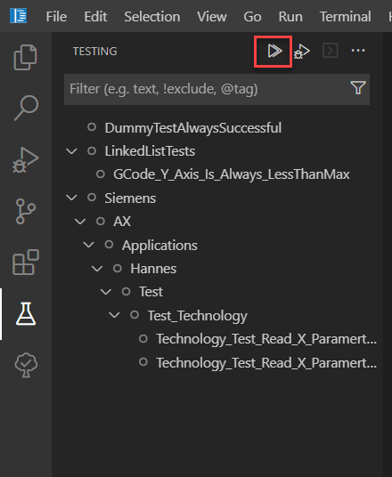
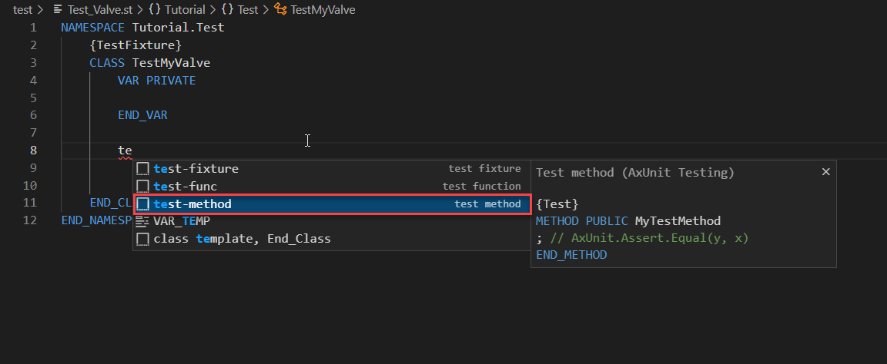

# Using the testing framework

## Goal for this training chapter

After this training session:

- you know the test explorer and the `Run tests` button
- you can execute tests within the IDE
- you've knowledge about the command line based testing
- you know a test class looks like
- you know how you create a test method
- you know what are assertions and how they're used
- use full qualified type identifier
- you know how parametrized tests are working and modify them
  
### The test explorer and executing tests

In the tutorial, there are a couple predefined tests shipped they can be executed.

1. Open the test explorer

    

1. Run the tests by clicking on `Run Tests`

    

1. See the test results

    

    **Alternative workflow**

    You can also execute the tests by command line command. You've just to enter `apax test` in a terminal.

    ```iec-st
    apax test
    ```

    > Note: in case of executing the tests by command line, the test explorer results will not be updated. The test results will be shown in the command line output.

### 

### Create a test for the new implemented class valve

1. Open the file `Test_Valve.st` in the folder `test`

    

    Here you can see a template for a test class. It's marked with the pragma `{TestFixture}`

1. Insert a test method. By entering `te`  `test-method` will be proposed. And press enter

    

    Test methods will be marked with the pragma `{Test}`

    

1. Change the name of the method to `Test_Open_valve_and_Expect_IsOpen_True`

    >Test methods should alway have a speech name //TODO speech??

1. In the next step we select our class we want to test. Therefore we declare the variable v in the VAR section

    ```iec-st
    VAR PRIVATE
        v : Simatic.Ax.Tutorial.Valve;
    END_VAR
    ```

    In this case we use the full qualified path for the Valve class. This is another way to define variables from namespaces beside the `USING` keyword.

1. To implement the test itself, we modify the method `MyTestMethod` in this way:

    ```iec-st
    {Test}
    METHOD PUBLIC Test_Open_valve_and_Expect_IsOpen_True
        v.Open();
        AxUnit.Assert.Equal(actual := v.IsOpen(), expected := TRUE);
    END_METHOD
    ```

    Explanation:

    1. The method `v.Open()` calls the method Open of the class valve. In this case we expect, that the method `IsOpen()` returns the value `TRUE`

    1. The expression `Equal(actual := v.IsOpen(), expected := TRUE);` contains the assertion `Equal` which check if the returned value of `IsOpen()` equals `TRUE`.

        Further assertions are:
        - NotEqual
        - LessThan
        - GreaterThan
  
        More information regarding testing, you'll find [here]([./images/test_fixture.png](https://console.prod.ax.siemens.cloud/docs/axunit))

## Summary

Goal reached? Check yourself...

- you know the test explorer and the `Run tests` button ✔
- you can execute tests within the IDE ✔
- you've knowledge about the command line based testing ✔
- you know a test class looks like ✔
- you know how you create a test method ✔
- you know what are assertions and how they're used ✔
- use full qualified type identifier ✔
- you know how parametrized tests are working and modify them ✔

- you know the test explorer and the `Run tests` button ✔
- you can execute tests within the IDE ✔
- you've knowledge about the command line based testing ✔
- you know what a test class is ✔
- you know what a test method is ✔
- you know what are assertions and how they're used ✔
- you know how parametrized tests are working and modify them ✔